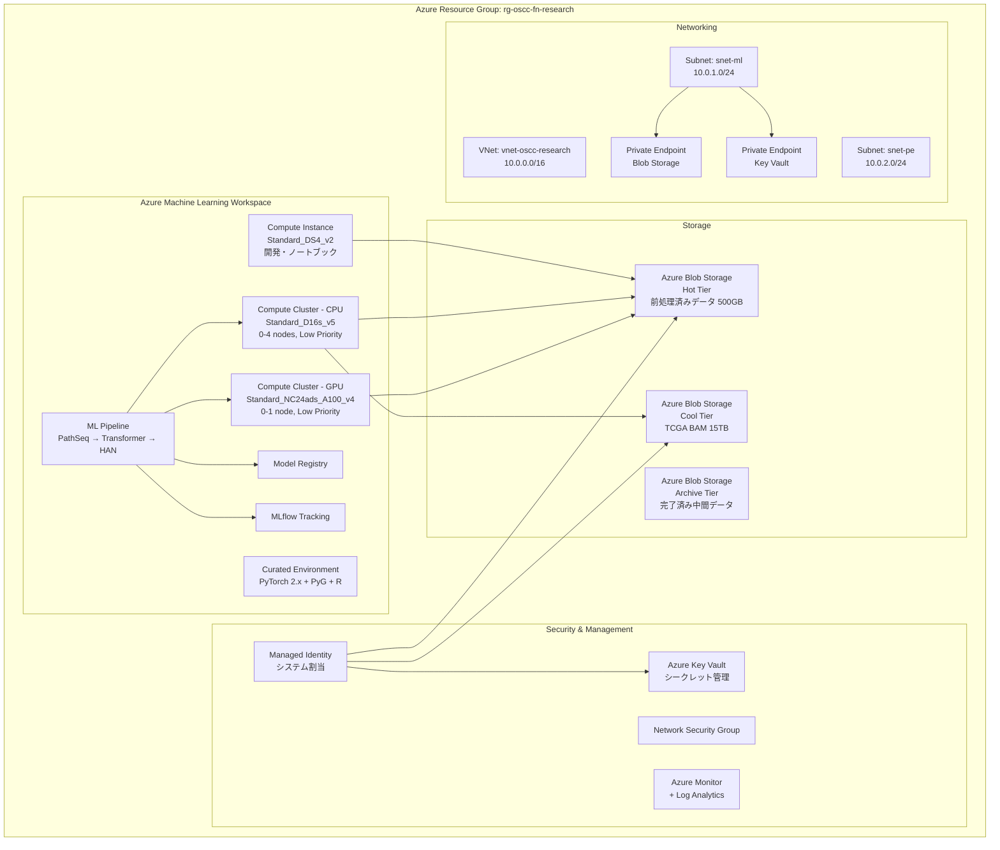
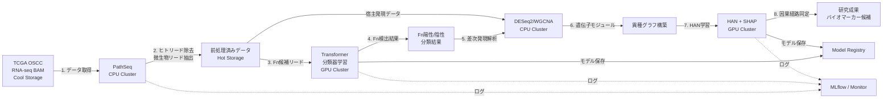

# Phase 1: Azure アーキテクチャ設計書

**プロジェクト名**: oscc-fn-ai-detection
**研究テーマ**: AIによる口腔扁平上皮癌内Fusobacterium nucleatum感染の可視化と腫瘍浸潤メカニズムの解明
**作成日**: 2026-05-04

---

## 1. 要件サマリー（Phase 0 研究計画書より）

### 1.1 計算要件

| フェーズ | 処理内容 | GPU要件 | CPU要件 | 推定処理時間 |
|---------|---------|---------|---------|------------|
| Phase A-1 | PathSeq前処理（ヒトリード除去） | 不要 | 16 vCPU, 64GB RAM | ~200時間 |
| Phase A-2 | Transformer分類器学習 | A100 40GB × 1 | — | ~48時間 |
| Phase A-3 | 大規模推論（300検体） | A100 40GB × 1 | — | ~24時間 |
| Phase B-1 | DESeq2 / WGCNA | 不要 | 16 vCPU, 64GB RAM | ~50時間 |
| Phase B-2 | HAN学習・SHAP解析 | A100 40GB × 1 | — | ~24時間 |
| 検証・再実験 | 各種再実験 | A100 40GB × 1 | — | ~48時間 |
| **合計** | | **~144 GPU時間** | **~300 CPU時間** | |

### 1.2 データ要件

| データ種別 | 容量 | アクセスパターン |
|-----------|------|----------------|
| TCGA OSCC BAMファイル（生データ） | ~15TB | 前処理時に1回読込後は低頻度 |
| 前処理済みデータ | ~500GB | 学習・推論時に高頻度アクセス |
| モデル・チェックポイント | ~50GB | 学習中に高頻度書込 |
| 中間結果・ログ | ~100GB | 中頻度 |

### 1.3 AI Foundry First Rule 評価

| タスク | AI Foundry適用可否 | 判定理由 |
|--------|------------------|---------|
| Transformer分類器（Fn配列分類） | ❌ 不可 | ドメイン特化のカスタムモデルをスクラッチ学習。k-merトークン化した生物配列への適用でありAI Foundryカタログに該当モデルなし |
| HAN（宿主-微生物グラフNN） | ❌ 不可 | カスタムGNNアーキテクチャ。PyTorch Geometricでのフルトレーニングが必須 |
| PathSeq前処理 | ❌ 不可 | GATK/バイオインフォマティクスパイプライン。CPU処理 |

**結論**: 全タスクがカスタムトレーニングまたはバイオインフォマティクスパイプラインであり、GPU VMの使用が適切。

---

## 2. アーキテクチャ概要

### 2.1 システム構成図（Mermaid）



### 2.2 データフロー図



---

## 3. Azure サービス構成詳細

### 3.1 コンピューティング

#### Azure Machine Learning Workspace

| コンポーネント | SKU / 構成 | 用途 | 備考 |
|-------------|-----------|------|------|
| Compute Instance | Standard_DS4_v2 (4 vCPU, 16GB RAM) | 開発・ノートブック・軽量テスト | 使用時のみ起動（自動シャットダウン設定） |
| CPU Compute Cluster | Standard_D16s_v5 (16 vCPU, 64GB RAM) | PathSeq前処理、DESeq2、WGCNA | min=0, max=4 nodes, Low Priority |
| GPU Compute Cluster | Standard_NC24ads_A100_v4 (24 vCPU, 220GB RAM, A100 40GB) | Transformer学習、HAN学習、推論 | min=0, max=1 node, Low Priority |

**Low Priority（Spot）選定理由**:
- 研究ワークロードはチェックポイント再開が可能であり、プリエンプション耐性が高い
- 通常価格比で約60-80%のコスト削減が見込める
- max=1 nodeのため、プリエンプション発生時の影響は限定的

#### リージョン選定

| 候補リージョン | NC24ads_A100_v4 可用性 | レイテンシ | 選定 |
|-------------|---------------------|----------|------|
| Japan East | ❌ 限定的 | 最低 | — |
| East US | ✅ 良好 | 中 | ✅ **採用** |
| East US 2 | ✅ 良好 | 中 | 代替候補 |

**選定理由**: Japan East では NC24ads_A100_v4 の可用性が限定的。East US はA100系VMの可用性が安定しており、TCGA データへのアクセス（NIH/NCI は米国所在）にも有利。ゲノムデータは個人識別不可能な形式で利用するため、リージョン外配置による法的制約は低い。

### 3.2 ストレージ

#### Azure Blob Storage（StorageV2, LRS）

| コンテナ | アクセス層 | 容量 | 用途 |
|---------|----------|------|------|
| `tcga-raw` | Cool | 15TB | TCGA OSCC BAMファイル（前処理後は低頻度アクセス） |
| `processed` | Hot | 500GB | 前処理済みデータ（学習時に高頻度アクセス） |
| `models` | Hot | 50GB | モデルチェックポイント・学習済みモデル |
| `results` | Hot → Cool | 100GB | 中間結果・解析ログ（完了後Coolへ移行） |

**ライフサイクル管理ポリシー**:
- `results` コンテナ: 最終アクセスから30日後にCool層へ自動移行
- `tcga-raw` コンテナ: 研究完了後（180日後）にArchive層へ自動移行

**冗長性**: LRS（Locally Redundant Storage）を選定。研究データの原本はTCGAに保持されているため、Geo冗長は不要。

### 3.3 ネットワーク

| コンポーネント | 構成 | 備考 |
|-------------|------|------|
| VNet | `vnet-oscc-research` (10.0.0.0/16) | 研究専用仮想ネットワーク |
| Subnet - ML | `snet-ml` (10.0.1.0/24) | AML Compute配置 |
| Subnet - PE | `snet-pe` (10.0.2.0/24) | Private Endpoint配置 |
| NSG | インバウンド: AML管理ポートのみ許可 | SSH直接アクセス不可 |
| Private Endpoint - Blob | `pe-blob-oscc` | Blob StorageへのVNet内アクセス |
| Private Endpoint - KV | `pe-kv-oscc` | Key VaultへのVNet内アクセス |

### 3.4 セキュリティ

| 項目 | 実装 |
|------|------|
| 認証 | Azure AD + Managed Identity（システム割当） |
| 認可 | RBAC: ワークスペースオーナー（研究者）、コンピュート利用者 |
| シークレット管理 | Azure Key Vault（ストレージキー、API資格情報） |
| データ暗号化 | Storage: SSE (Microsoft管理キー) + TLS 1.2 |
| ネットワーク分離 | Private Endpoint + VNet統合、パブリックアクセス無効化 |
| 監査 | Azure Monitor + Log Analytics による操作ログ記録 |

**注**: 本研究で使用するTCGAデータは公開ゲノムデータ（de-identified）であり、個人情報保護法上の「個人情報」に該当しない。ただし、研究倫理の観点からネットワーク分離とアクセス制御を実装する。

### 3.5 監視・運用

| コンポーネント | 用途 |
|-------------|------|
| Azure Monitor | リソースメトリクス（CPU/GPU使用率、メモリ、ディスクI/O） |
| Log Analytics Workspace | 集中ログ管理・クエリ |
| MLflow (AML統合) | 実験トラッキング、ハイパーパラメータ記録、モデルバージョニング |
| アラート | GPU使用率 < 10% が30分継続で通知（コスト浪費防止） |
| 自動シャットダウン | Compute Instance: 平日18:00 JST自動停止 |

---

## 4. ML パイプライン設計

### 4.1 パイプライン構成

```
Pipeline: oscc-fn-detection-pipeline
├── Step 1: data-download (CPU)
│   └── TCGA GDC APIからBAMファイルダウンロード → Cool Storage
├── Step 2: pathseq-preprocessing (CPU Cluster, 並列)
│   └── PathSeqPipelineSpark によるヒトリード除去 → Hot Storage
├── Step 3: transformer-training (GPU Cluster)
│   └── シミュレーションデータ + 実データでTransformer学習
├── Step 4: fn-inference (GPU Cluster)
│   └── 全300検体に対するFn検出推論
├── Step 5: deseq2-wgcna (CPU Cluster)
│   └── 差次発現解析 + 共発現ネットワーク
├── Step 6: graph-construction (CPU)
│   └── 異種グラフ構築（遺伝子-微生物-パスウェイ）
├── Step 7: han-training (GPU Cluster)
│   └── HAN学習 + SHAP解析
└── Step 8: results-aggregation (CPU)
    └── 結果統合・可視化・レポート生成
```

### 4.2 チェックポイント戦略

- **Transformer学習**: 5エポックごとにチェックポイント保存（Blob Storage `models` コンテナ）
- **HAN学習**: 10エポックごとにチェックポイント保存
- **Low Priority VMプリエンプション対策**: チェックポイントからの自動再開スクリプト実装
- MLflow によるメトリクス・パラメータの永続記録

### 4.3 Environment（実行環境）

```yaml
name: oscc-fn-research-env
channels:
  - pytorch
  - conda-forge
  - bioconda
  - defaults
dependencies:
  - python=3.11
  - pytorch=2.2
  - torchvision
  - pyg=2.5          # PyTorch Geometric
  - transformers=4.40
  - numpy
  - pandas
  - scikit-learn
  - shap
  - matplotlib
  - seaborn
  - bwa-mem2          # アライメント
  - samtools          # BAM操作
  - pip:
    - mlflow
    - azureml-sdk
    - captum           # PyTorch解釈性ツール
# R環境（DESeq2/WGCNA用）は別Environmentとして構築
```

---

## 5. WAF Best Practices Compliance

### 5.1 Reliability（信頼性）

| チェック項目 | 対応状況 | 実装内容 |
|------------|---------|---------|
| チェックポイント・リカバリ | ✅ | 定期チェックポイント + Blob永続化 |
| Spot VM プリエンプション対策 | ✅ | 自動再開スクリプト、MLflow状態保持 |
| データ冗長性 | ✅ | LRS（原本はTCGA保持）、モデルはBlob + Model Registry二重保存 |
| 可用性ゾーン | ⚠️ N/A | 単一研究者プロジェクト、HA不要 |

### 5.2 Security（セキュリティ）

| チェック項目 | 対応状況 | 実装内容 |
|------------|---------|---------|
| ネットワーク分離 | ✅ | VNet + Private Endpoint + パブリックアクセス無効 |
| Managed Identity | ✅ | システム割当MI、キーレス認証 |
| RBAC | ✅ | 最小権限の原則に基づくロール割当 |
| シークレット管理 | ✅ | Key Vault、ハードコード禁止 |
| 保存時暗号化 | ✅ | SSE (Microsoft管理キー) |
| 転送時暗号化 | ✅ | TLS 1.2+ |

### 5.3 Cost Optimization（コスト最適化）

| チェック項目 | 対応状況 | 実装内容 |
|------------|---------|---------|
| 自動スケーリング | ✅ | Compute Cluster min=0（アイドル時ゼロコスト） |
| Spot/Low Priority VM | ✅ | GPU/CPU Cluster共にLow Priority |
| ストレージ階層化 | ✅ | Hot/Cool/Archive のライフサイクル管理 |
| 自動シャットダウン | ✅ | Compute Instance 18:00 JST自動停止 |
| 不要リソース監視 | ✅ | GPU低使用率アラート |

### 5.4 Operational Excellence（運用卓越性）

| チェック項目 | 対応状況 | 実装内容 |
|------------|---------|---------|
| IaC | ✅ | Bicep テンプレート（Phase 5で生成） |
| MLOps | ✅ | AML Pipeline + MLflow + Model Registry |
| 監視・ログ | ✅ | Azure Monitor + Log Analytics |
| 再現性 | ✅ | Environment定義 + MLflow実験記録 |

### 5.5 Performance Efficiency（パフォーマンス効率）

| チェック項目 | 対応状況 | 実装内容 |
|------------|---------|---------|
| GPU利用率最適化 | ✅ | Mixed Precision (AMP)、適切なbatch size |
| リージョン配置 | ✅ | East US（A100可用性 + TCGAデータ近接） |
| ストレージIOPS | ✅ | Hot Tier + Premium不要（シーケンシャルアクセス中心） |
| データローカリティ | ✅ | 学習データはHot Storageに前処理済みで配置 |

---

## 6. コスト概算（参考値）

> ⚠️ 正式なコスト見積もりは Phase 2（spread1000-cost-estimator）で Azure Retail Prices API を用いて算出します。以下は設計の妥当性確認用の概算です。

| リソース | SKU | 月額概算 (USD) | 備考 |
|---------|-----|-------------|------|
| GPU Cluster | NC24ads_A100_v4, Low Priority | ~$500-800 | 月約144時間使用想定 |
| CPU Cluster | D16s_v5 × 4 nodes, Low Priority | ~$300-500 | 月約300時間使用想定 |
| Compute Instance | DS4_v2 | ~$150 | 営業日8時間/日想定 |
| Blob Storage (Hot 650GB) | StorageV2 LRS | ~$15 | |
| Blob Storage (Cool 15TB) | StorageV2 LRS | ~$150 | |
| Key Vault | Standard | ~$5 | |
| VNet / Private Endpoint | — | ~$20 | |
| Monitor / Log Analytics | — | ~$30 | |
| **月額合計概算** | | **~$1,170-1,670** | |
| **180日（6ヶ月）概算** | | **~$7,000-10,000** | ≒ 約100-150万円 |

SPReAD補助上限500万円（直接経費）に対して、Azure計算資源コストは約100-150万円と見積もられ、予算内に十分収まる。残額はデータ取得費用、論文投稿料、その他研究経費に充当可能。

---

## 7. リソース命名規則

| リソース種別 | 命名パターン | 例 |
|------------|------------|---|
| Resource Group | `rg-{project}` | `rg-oscc-fn-research` |
| ML Workspace | `mlw-{project}` | `mlw-oscc-fn-research` |
| Storage Account | `st{project}` | `stoscfnresearch` |
| Key Vault | `kv-{project}` | `kv-oscc-fn-research` |
| VNet | `vnet-{project}` | `vnet-oscc-fn-research` |
| Compute Instance | `ci-{purpose}` | `ci-dev-notebook` |
| Compute Cluster (CPU) | `cc-{purpose}` | `cc-cpu-preprocessing` |
| Compute Cluster (GPU) | `cc-{purpose}` | `cc-gpu-training` |

---

## 8. 設計検証結果

### 研究要件とのマッピング

| 研究要件 | Azure リソース | 充足度 |
|---------|--------------|--------|
| PathSeq前処理（CPU, 64GB RAM） | D16s_v5 × 4 nodes | ✅ 100% |
| Transformer学習（A100 40GB） | NC24ads_A100_v4 × 1 | ✅ 100% |
| HAN学習（A100 40GB） | NC24ads_A100_v4 × 1 | ✅ 100% |
| 生データストレージ（15TB） | Blob Cool 15TB | ✅ 100% |
| 前処理データストレージ（500GB） | Blob Hot 500GB | ✅ 100% |
| 実験管理・再現性 | MLflow + Model Registry | ✅ 100% |
| セキュリティ（ネットワーク分離） | VNet + Private Endpoint | ✅ 100% |

**全要件充足率: 100%**

---

> **⚠️ 免責事項**: 本文書は AI（SPReAD Builder）が生成した参考資料です。内容の正確性・完全性は保証されません。公的機関への提出前に、応募者ご自身の責任で内容を精査・修正してください。
