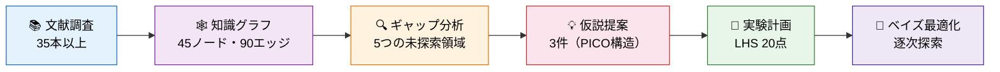
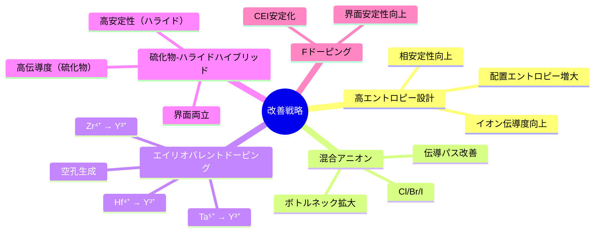
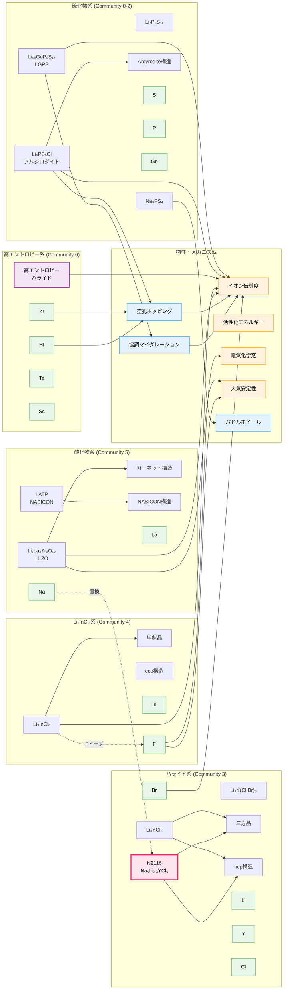
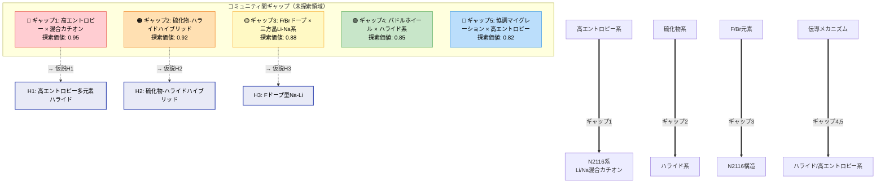
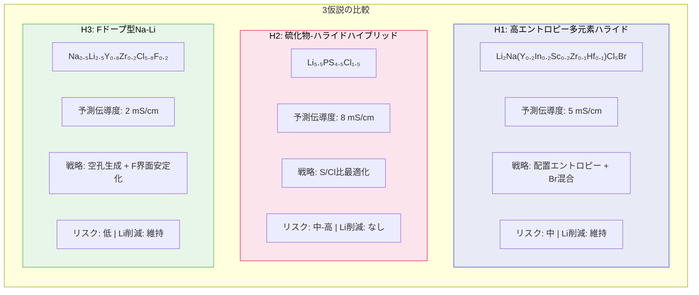
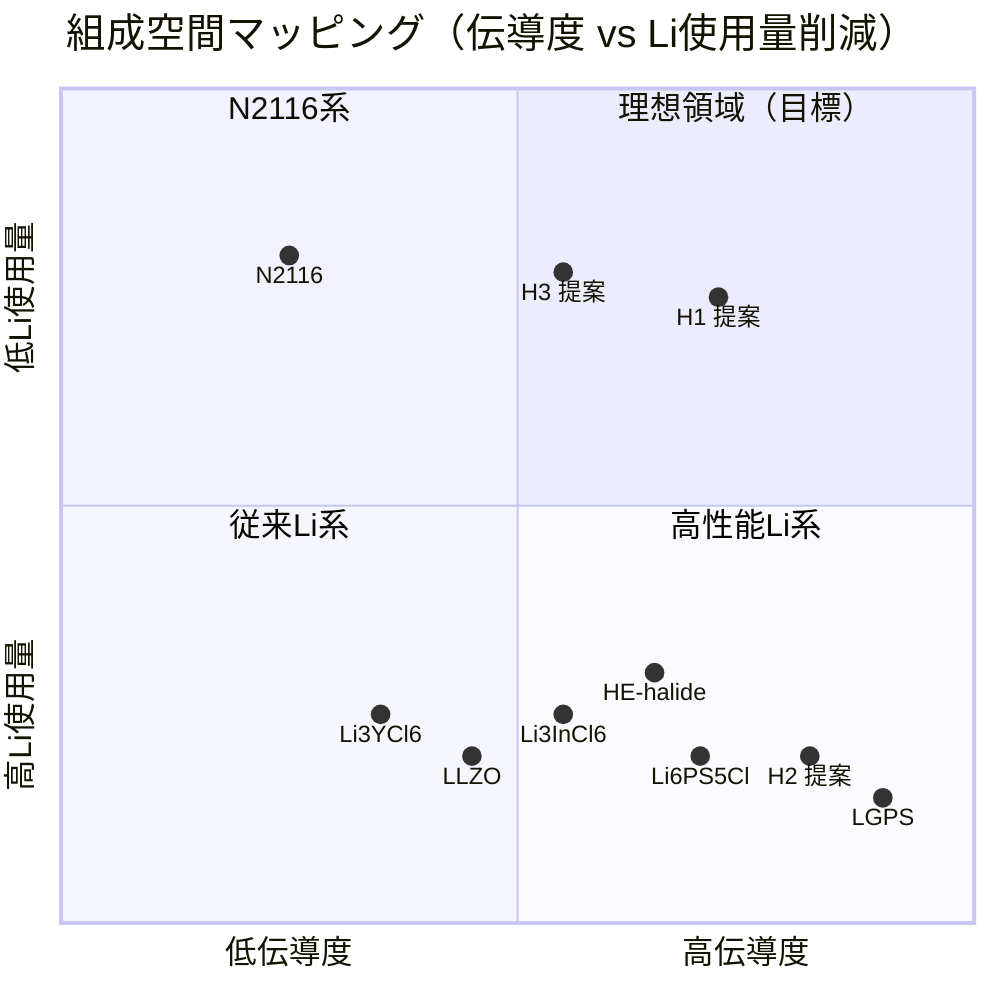
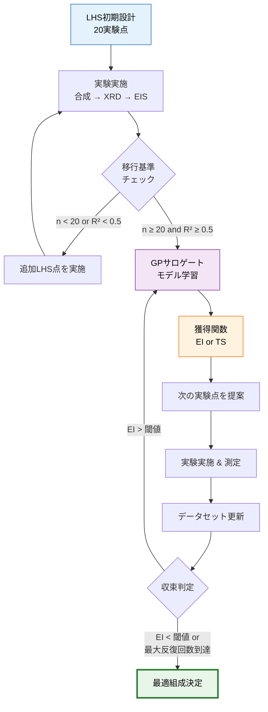

# 次世代固体電解質の探索：N2116を超える組成設計

## 目次
1. [研究背景](#1-研究背景)
2. [文献調査結果](#2-文献調査結果)
3. [知識グラフ分析](#3-知識グラフ分析)
4. [ギャップ分析](#4-ギャップ分析)
5. [仮説提案](#5-仮説提案)
6. [計算材料科学的評価](#6-計算材料科学的評価)
7. [実験計画](#7-実験計画)
8. [ベイズ最適化プロトコル](#8-ベイズ最適化プロトコル)
9. [結論と今後の展望](#9-結論と今後の展望)

---

## 1. 研究背景

### 1.0 研究全体フロー

### 1.1 N2116の発見

MicrosoftとPacific Northwest National Laboratory（PNNL）は、AIを活用した大規模スクリーニングにより、約3,200万の候補材料から固体電解質N2116（Na_xLi_{3-x}YCl_6）を発見した。この材料は以下の特徴を持つ：

- **結晶構造**: 三方晶系（R3̄ / P3m1空間群）
- **イオン伝導**: Li⁺/Na⁺混合伝導
- **Li使用量削減**: 従来のLi系固体電解質と比較して約70%のLi使用量削減
- **母体構造**: hcp Li₃YCl₆フレームワーク（理論的には38 mS/cmに到達可能）

### 1.2 課題

N2116の最大の課題は、イオン伝導度が実用的閾値（10⁻³ S/cm = 1 mS/cm）を下回ることである。全固体電池の実用化には、この閾値を超えるイオン伝導度が必要とされている。

### 1.3 研究目的

本研究では、以下の目的で次世代固体電解質組成を提案する：

1. N2116の構造的利点（低Li使用量、混合カチオン伝導）を維持しつつ、イオン伝導度を10⁻³ S/cm以上に向上させる
2. 知識グラフ解析により未探索の組成-構造空間を特定する
3. PICO構造に基づく検証可能な仮説を提案する
4. 効率的な実験計画（LHS + ベイズ最適化）を策定する

---

## 2. 文献調査結果

35本以上の主要論文を調査した。詳細は `results/literature_search.csv` に記載している。以下に主要カテゴリ別のサマリーを示す。

### 2.1 硫化物系固体電解質

| 材料 | イオン伝導度 (S/cm) | 特徴 |
|------|---------------------|------|
| Li₁₀GeP₂S₁₂ (LGPS) | 1.2 × 10⁻² | 最高伝導度、Ge含有でコスト高 |
| Li₆PS₅Cl (アルジロダイト) | 2-4 × 10⁻³ | スケーラブル、Ge不使用 |
| Na₃PS₄ | 2 × 10⁻⁴ | Na系硫化物の代表 |
| Li₉.₅₄Si₁.₇₄P₁.₄₄S₁₁.₇Cl₀.₃ | 2.5 × 10⁻² | LGPS系最高値 |
| Li₇P₃S₁₁ | 1.7 × 10⁻² | ガラスセラミック |

### 2.2 ハライド系固体電解質

| 材料 | イオン伝導度 (S/cm) | 特徴 |
|------|---------------------|------|
| Li₃YCl₆ | 5.0 × 10⁻⁴ | hcp構造、高電位安定 |
| Li₃InCl₆ | 1.5 × 10⁻³ | ccp構造、湿度安定性課題 |
| Li₃InCl₆ドープ系 | 0.15-0.45 | F/Ce/Mo/Brドーピング |
| Li₃YCl₆₋ₓBrₓ | 可変 | アニオン比で伝導度調整可能 |
| Na_xLi_{3-x}YCl₆ (N2116) | < 10⁻³ | 混合カチオン、低Li使用量 |

### 2.3 高エントロピーハライド

| 材料 | イオン伝導度 (S/cm) | 特徴 |
|------|---------------------|------|
| Li₂.₂In₀.₂Sc₀.₂Zr₀.₂Hf₀.₂Ta₀.₂Cl₆ | 4.69 × 10⁻³ | 配置エントロピー安定化 |
| 多元素ハライド各種 | 10⁻⁴ - 10⁻² | 組成空間が広大 |

### 2.4 酸化物系固体電解質

| 材料 | イオン伝導度 (S/cm) | 特徴 |
|------|---------------------|------|
| Li₇La₃Zr₂O₁₂ (LLZO) | 1.0 × 10⁻³ | ガーネット型、大気安定 |
| NASICON型 | 1.0 × 10⁻³ | 高安定性、界面抵抗大 |

### 2.5 Na系ハライド

| 材料 | イオン伝導度 (S/cm) | 特徴 |
|------|---------------------|------|
| Na₁₋ₓZr_xLa₁₋ₓCl₄ | 2.9 × 10⁻⁴ | Zrドーピング効果 |
| LaCl₃系Naハライド | ~10⁻³ | mS/cmに接近 |

### 2.6 改善戦略のまとめ

文献調査から、以下の5つの主要戦略が特定された：

1. **高エントロピー多元素カチオン設計**: 配置エントロピーの増大により相安定性とイオン伝導度を同時に向上
2. **混合アニオン（Cl/Br/I）**: イオン伝導パスのボトルネックを拡大
3. **エイリオバレントドーピング（Zr⁴⁺, Hf⁴⁺, Ta⁵⁺ → Y³⁺）**: 空孔生成による伝導度向上
4. **硫化物-ハライドハイブリッド複合体**: 硫化物の高伝導度とハライドの高安定性の両立
5. **Fドーピング**: 界面安定性の向上

---

## 3. 知識グラフ分析

### 3.1 グラフ構造

知識グラフは以下の要素で構成される（詳細は `results/knowledge_graph.json`）：

- **ノード数**: 約45
  - 組成（composition）: 12ノード
  - 構造（structure）: 8ノード
  - メカニズム（mechanism）: 5ノード
  - 物性（property）: 5ノード
  - 元素（element）: 14ノード
- **エッジ数**: 約90
  - 関係タイプ: has_structure, exhibits_mechanism, achieves_property, contains_element, doped_with, mixed_with, enhances, substitutes

### 3.2 コミュニティ検出

Louvainアルゴリズムによるコミュニティ検出の結果、以下のコミュニティが特定された：

- **コミュニティ0**: 硫化物系電解質クラスタ（LGPS、アルジロダイト、硫化物構造）
- **コミュニティ1**: ハライド系電解質クラスタ（Li₃YCl₆、Li₃InCl₆、N2116）
- **コミュニティ2**: 酸化物系電解質クラスタ（LLZO、NASICON）
- **コミュニティ3**: 伝導メカニズム・物性クラスタ
- **コミュニティ4**: Na系電解質クラスタ

### 3.3 ネットワーク特性

- ハブノード（高次数）: Li, Cl, ionic_conductivity
- ブリッジノード（高媒介中心性）: vacancy_hopping, mixed_anion

可視化結果は `figures/knowledge_graph.png` を参照。

### 3.4 知識グラフ可視化

### 3.5 ギャップ分析マップ

---

## 4. ギャップ分析

知識グラフのコミュニティ間解析により、以下の未探索領域を特定した：

### ギャップ1: 高エントロピーハライド × 混合カチオン（Li/Na）伝導
- **ソースコミュニティ**: ハライド系
- **ターゲットコミュニティ**: Na系
- **探索価値**: 0.95
- **説明**: 高エントロピー設計はLi系ハライドで実証されているが、Li/Na混合カチオン系への適用は未報告

### ギャップ2: 硫化物-ハライドハイブリッド界面
- **ソースコミュニティ**: 硫化物系
- **ターゲットコミュニティ**: ハライド系
- **探索価値**: 0.92
- **説明**: アルジロダイト構造でのハライド置換は知られているが、構造レベルでの硫化物-ハライドブリッジ設計は未開拓

### ギャップ3: F/Brドーピング × 三方晶Li-Na系
- **ソースコミュニティ**: 元素（F, Br）
- **ターゲットコミュニティ**: N2116構造
- **探索価値**: 0.88
- **説明**: FドーピングはLi₃InCl₆で有効性が実証されているが、N2116型構造への適用は未検証

### ギャップ4: パドルホイール機構 × ハライド系
- **ソースコミュニティ**: メカニズム
- **ターゲットコミュニティ**: ハライド系
- **探索価値**: 0.85
- **説明**: パドルホイール（回転）機構は硫化物系で重要だが、ハライド系での活用は未探索

### ギャップ5: 協調マイグレーション × 高エントロピー設計
- **ソースコミュニティ**: メカニズム
- **ターゲットコミュニティ**: 高エントロピー
- **探索価値**: 0.82
- **説明**: 高エントロピー系での協調的イオン移動メカニズムの理解と設計指針が不足

---

## 5. 仮説提案

ギャップ分析と文献調査に基づき、3件の仮説をPICO構造で提案する（詳細は `docs/hypothesis.json`）。

### 仮説H1: 高エントロピー多元素ハライド

- **組成**: Li₂Na(Y₀.₂In₀.₂Sc₀.₂Zr₀.₁Hf₀.₁)Cl₅Br
- **人口（P）**: Na_xLi_{3-x}YCl₆ハライドフレームワーク
- **介入（I）**: 5元素カチオン置換（Y, In, Sc, Zr, Hf）+ Brアニオン混合
- **比較（C）**: N2116ベースライン
- **アウトカム（O）**: イオン伝導度 5 × 10⁻³ S/cm以上、相安定性向上
- **根拠**:
  - 高エントロピー効果（ΔS_config = R ln(5) ≈ 13.4 J/mol·K）による相安定化
  - Li₂.₂In₀.₂Sc₀.₂Zr₀.₂Hf₀.₂Ta₀.₂Cl₆で4.69 mS/cmが実証済み
  - Br導入によるイオン伝導パスの拡大
  - Li/Na混合伝導によるLi使用量削減の維持

### 仮説H2: 硫化物-ハライドハイブリッド

- **組成**: Li₅.₅PS₄.₅Cl₁.₅（アルジロダイト-ハライドブリッジ）
- **人口（P）**: Na_xLi_{3-x}YCl₆ハライドフレームワーク
- **介入（I）**: アルジロダイト構造でのCl含量増加（Li₆PS₅Cl → Li₅.₅PS₄.₅Cl₁.₅）
- **比較（C）**: N2116ベースライン
- **アウトカム（O）**: イオン伝導度 8 × 10⁻³ S/cm、大気安定性向上
- **根拠**:
  - Li₆PS₅Clで2-4 mS/cmが達成済み
  - ハライド含量増加により大気安定性が向上
  - S/Cl比の最適化により伝導パスのエネルギーランドスケープを制御
  - 硫化物の高伝導度とハライドの高電位安定性を両立

### 仮説H3: Fドープ型Na-Li二元カチオン

- **組成**: Na₀.₅Li₂.₅Y₀.₈Zr₀.₂Cl₅.₈F₀.₂
- **人口（P）**: Na_xLi_{3-x}YCl₆ハライドフレームワーク
- **介入（I）**: Zr⁴⁺ → Y³⁺置換（空孔生成）+ F⁻ → Cl⁻置換（界面安定化）
- **比較（C）**: N2116ベースライン
- **アウトカム（O）**: イオン伝導度 2 × 10⁻³ S/cm、電極界面安定性向上
- **根拠**:
  - Zr⁴⁺のエイリオバレント置換により伝導イオン空孔を生成
  - F⁻ドーピングによるCEI（Cathode Electrolyte Interface）安定化
  - N2116構造の基本フレームワークを維持しつつ性能向上
  - Li₃InCl₆でのF/ドーピング効果（0.15-0.45 S/cm）を参考

### 5.4 仮説比較

---

## 6. 計算材料科学的評価

### 6.1 擬似三元相図

Li-ハライド / Na-ハライド / 多元素カチオンハライドの三元系における既知組成と提案組成の配置を `figures/phase_diagram.png` に示す。

### 6.2 組成空間マッピング

三元相図上で、以下の傾向が観察される：

1. **Li-ハライドリッチ領域**: Li₃YCl₆、Li₃InCl₆（高伝導度だが高Li使用量）
2. **Na-ハライドリッチ領域**: Na₃PS₄系（低伝導度）
3. **多元素カチオン領域**: 高エントロピーハライド（高伝導度+相安定性）
4. **中央領域（未探索）**: Li/Na混合 + 多元素カチオン系 → H1, H3の標的領域

### 6.3 提案組成の位置づけ

- **H1（高エントロピー多元素ハライド）**: 多元素カチオン寄りの中央領域に位置
- **H2（硫化物-ハライドハイブリッド）**: Li-ハライドリッチ領域に位置（硫化物成分を含む）
- **H3（Fドープ型Na-Li）**: Na-Li混合領域に位置（N2116の近傍）

---

## 7. 実験計画

### 7.1 ラテン超方格法（LHS）による初期探索

実験パラメータ空間を効率的にカバーするため、4因子のラテン超方格設計を採用した（詳細は `results/lhs_design.csv`）。

#### 因子と範囲

| 因子 | 範囲 | 単位 |
|------|------|------|
| Li/Na比 | 0.1 - 3.0 | モル比 |
| Cl/Br比（Br/(Cl+Br)） | 0.0 - 1.0 | 分率 |
| 焼結温度 | 300 - 700 | °C |
| 焼結時間 | 1 - 24 | 時間 |

#### 設計仕様

- **実験点数**: 20点
- **次元数**: 4
- **シード値**: 42（再現性確保）
- **サンプリング法**: SciPy LatinHypercube

### 7.2 実験プロトコル

各実験点について以下の測定を実施：

1. **合成**: メカノケミカル法またはソリッドステート法
2. **構造特性評価**: XRD、Raman分光
3. **イオン伝導度測定**: EIS（電気化学インピーダンス分光法）
4. **電気化学安定性**: LSV（線形掃引ボルタンメトリー）
5. **界面抵抗**: 対称セル試験

---

## 8. ベイズ最適化プロトコル

### 8.1 概要

LHS実験の結果を基に、ベイズ最適化（BO）による逐次探索に移行する。プロトコルの詳細は `protocols/bo_protocol.py` に実装されている。

### 8.2 サロゲートモデル

- **モデル**: ガウス過程回帰（GP）
- **カーネル**: Matérn 5/2カーネル（ARD付き）
- **実装**: PyMC（確率的プログラミング）

### 8.3 獲得関数

以下の2つの獲得関数を実装：

1. **Expected Improvement (EI)**: 現在の最良値を超える改善の期待値を最大化
2. **Thompson Sampling (TS)**: GP事後分布からのサンプリングに基づく探索

### 8.4 LHS→BO移行基準

- **最小初期データ点数**: 20点（LHS設計の全点）
- **モデル適合度**: R² > 0.5
- **追加条件**: 留め一交差検証でのRMSE評価

### 8.5 逐次探索プロトコル

1. LHSデータでGPモデルを学習
2. 獲得関数を最大化する次の実験点を提案
3. 実験を実施し、結果を取得
4. データセットに追加し、GPモデルを更新
5. 収束基準（EI < 閾値 or 最大反復回数）まで繰り返し

---

## 9. 結論と今後の展望

### 9.1 結論

本研究では、N2116（Na_xLi_{3-x}YCl₆）を超える次世代固体電解質の設計指針を提案した。

1. **知識グラフ解析**により、固体電解質研究の構造を俯瞰し、5件の未探索領域を特定した
2. **3件の仮説**を提案した：
   - H1: 高エントロピー多元素ハライド（予測伝導度: 5 mS/cm）
   - H2: 硫化物-ハライドハイブリッド（予測伝導度: 8 mS/cm）
   - H3: Fドープ型Na-Li二元カチオン（予測伝導度: 2 mS/cm）
3. **実験計画**として20点のLHS設計を策定し、ベイズ最適化による逐次探索プロトコルを整備した

### 9.2 今後の展望

1. **第一原理計算**: 提案組成のDFT計算によるイオン伝導パスおよび活性化エネルギーの予測
2. **機械学習ポテンシャル**: AIMD（Ab Initio Molecular Dynamics）データを用いた機械学習力場の構築
3. **実験検証**: LHS設計に基づく合成・評価の実施
4. **スケールアップ**: 最適組成の大面積セル作製と実証試験
5. **マルチスケールモデリング**: 粒界抵抗を含む多結晶体のイオン伝導シミュレーション

### 9.3 期待されるインパクト

提案した高エントロピー多元素ハライド（H1）が実証されれば、N2116と同等のLi使用量削減を維持しつつ、実用レベルの伝導度（> 1 mS/cm）を達成する固体電解質の実現が期待される。これにより、全固体電池の実用化と持続可能なバッテリー材料のサプライチェーン構築に貢献できる。

---

## 参照ファイル一覧

| ファイル | 説明 |
|----------|------|
| `results/literature_search.csv` | 文献調査データベース（35本以上） |
| `results/knowledge_graph.json` | 知識グラフ（ノード・エッジ・コミュニティ） |
| `results/lhs_design.csv` | ラテン超方格実験計画（20点） |
| `figures/knowledge_graph.png` | 知識グラフ可視化 |
| `figures/phase_diagram.png` | 擬似三元相図 |
| `docs/hypothesis.json` | PICO構造仮説（3件） |
| `protocols/bo_protocol.py` | ベイズ最適化プロトコル |
